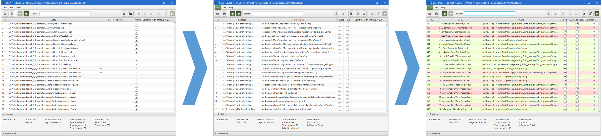

	

# BREW
The Benchmark Refinement and Execution Wizard (BREW) can be used to do what the name suggests, first refine and then execute a benchmark.
For the refinement step it guides the user through 3 steps, all adding additional and typically missing information to a benchmark.

	

The benchmark execution can be started directly via the GUI shown above or via command line.

## Usage
Our wiki contains [tutorials](https://github.com/FoelliX/BREW/wiki) on how to use BREW.
However, in order to execute benchmark the underlying [AQL-System](https://github.com/FoelliX/AQL-System) must be configured.
A tutorial that explains the configuration process can be found: [here](https://github.com/FoelliX/AQL-System/wiki).

## Publications
- *Do Android Taint Analysis Tools Keep their Promises?* (Felix Pauck, Eric Bodden, Heike Wehrheim)  
Technical Report: [https://arxiv.org/abs/1804.02903](https://arxiv.org/abs/1804.02903)

## License
BREW is licensed under the *GNU General Public License v3* (see [LICENSE](https://github.com/FoelliX/AQL-System/blob/master/LICENSE)).

# Contact

**Felix Pauck**  
Paderborn University  
fpauck@mail.uni-paderborn.de  
[Homepage](https://cs.uni-paderborn.de/sms/team/group/people/felix-pauck)

# Links
- BREW is part of the ReproDroid toolchain: [https://github.com/FoelliX/ReproDroid](https://github.com/FoelliX/ReproDroid)
- and internally uses the AQL-System: [https://github.com/FoelliX/AQL-System](https://github.com/FoelliX/AQL-System)